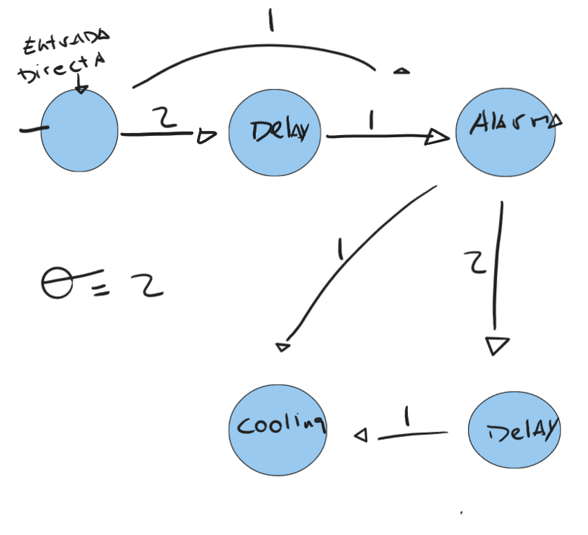

# Memoria Practica 1 Neurocomputacion

## Estructura de la práctica
Como podrá comprobar la práctica se divide en distintos ejercicios cada uno guardado en un directorio, en la base del
trabajo encontrará las clases fundamentales para el funcionamiento de todo, allí podrá estudiar y verificar los procesos
realizados por dentro de cada ejercicio. Se han añadido dos carpetas no obligatorias llamada eje3 y eje4 estas son 
jupyter notebooks que permiten la ejecucion del codigo con información de una manera un poco más compacta y simple, puede
ser muy útil a la hora de corregir cada uno de dichos ejercicios, por último encontrará en eje4_2_2 la prueba con el read1
ejecutable mediante el makefile

## Ejercicio 1
Para demostrar el funcionamiento de nuestra red, hemos creado el ejercicio1 o eje1 como se puede comprobar en los 
archivos, dicho ejercicio crea una serie de neuronas directas, las añade a distintas capas y realiza las funciones 
básicas de propagación, disparo e inicialización.

Para entrar un poco en más detalle nos dividimos en las clases básicas definidas en el enunciado.
Cabe destacar sin embargo, que hemos implementado el perceptrón y el Adaline como dos tipos nuevos de neurona con sus
respectivos métodos, más no hemos incluido entre dichos métodos, el aprendizaje de estos, principalmente porque, desde
una perspectiva de código no tiene mucho sentido que una neurona entrene una red, si no sabe de la existencia de dicha 
red. O en otras palabras, para mantener la separación lógica entre red y neurona no hemos implementado los métodos train
como parte de la clase Adaline o Perceptron.

## Ejercicio 2.1
Para la realizacion del ejercicio, hemos realizado una red de neuronas mcculloch Pitts
cabe destacar que el resultado que obtenemos no es igual al presentado en la tabla del enunciado 
debido a:
 - Este no tiene en cuenta que la funcion fire se ha de ejecutar con un desfase respecto a cuando llega el input
por la mera definicion de mcculloch pitts se presenta un desfase de 1 tiempo respecto al input recibido y dicha tabla 
no lo respeta

 - Para probar dicho funcionamiento encontrara en la funcion ej1 la ejecucion de nuestra red en ella se puede apreciar
los outputs de la misma y como responde a las distintas entradas
### Estructura de la red

## Ejercicio 3

Encontrará las distintas funciones requeridas realizadas y con una breve explicacion al pie de cada una.

## Ejercicio 4

Las Fronteras de los algoritmos utilizando una inicializacion de pesos a cero, un aprendizaje de 1 y un threshold de 
0.2 son:

### Perceptrón:
 - And.txt: 2x1 + 3x2 = 4
 - Or.txt: 2x1 + 2x2 = 1
 - Nand.txt: 3x1 + 2x2 = -4  
### Adaline
 - And.txt: 2x1 + 4x2 = 4
 - Or.txt: 2x1 + 2x2 = 2
 - Nand.txt: 2x1 + 4x2 = -4

El problema que no puede solucionarse resulta ser la puerta xor, esto se debe principalmente a que es un problema no separable
linealmente, presentándose como un problema imposible para Perceptrones o adaline de una sola capa, esto podría resolverse
metiendo una o varias capas ocultas de tal manera que permitamos al perceptron o adaline resolver problemas más complejos.

### Ejercicio 4.2
Tanto nuestro Adaline como nuestro Perceptron comparten estructura, estos se basan en el uso de un forward, encargado de 
generar una respuesta sin delay. Ambos miden el MSE en cada una de sus épocas y además son capaces de minimizarlo mediante
la actualización de los distintos pesos en las conexiones de la red.

El MSE se reduce hasta converger en los problemas linealmente separables, en aquellos que no lo son ha de acercarse a cero
y parar en la época definida por nosotros puesto, que sino simplemente oscilarían los valores hasta el infinito.
### Ejercicio 4.3
Los distintos parámetros a incluir pueden generar una gran variedad de cambios:
- Max epochs limita el número máximo de épocas de estudio, esto nos permite ver en casos como el de los problemas real 1 y 2
, que el mse se reduce, pero no podemos hacerlo converger, puesto que el sistema no es capaz de analizar problemas no lineales.

- El alpha se encarga de la tasa de aprendizaje del sistema, en caso de ser muy grande puede no ser suficientemente preciso
y en caso de ser demasiado pequeño puede llevarnos a caer en mínimos parciales

- El threshold se encarga de verificar en el caso del adaline, para verificar si el cambio más grande realizado en los pesos es
relevante aún para el estudio, mientras que en el perceptrón nos permite identificar nuestra zona de indecisión.